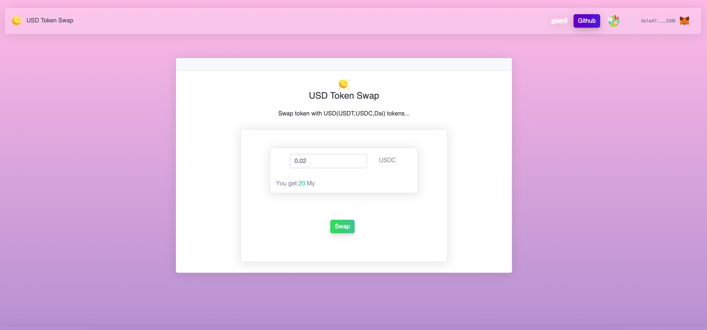

# USD-Token-To-Token
Swap your token with USD(USDT,USDC,Dai) tokens...

Install as your own token sale platform

First make sure the metamask plugin is installed

modify js/config.js.

1.Specify your token address

2.Deploy contract/SwapToken.sol and fill the contract address to js/config.js

3.fill blockchain parameters.

4.you need send some your tokens to this contract address ,otherwise, the exchange doesn't have token send to trader.

5.put the whole project to a www websever or deploy to your github pages.

